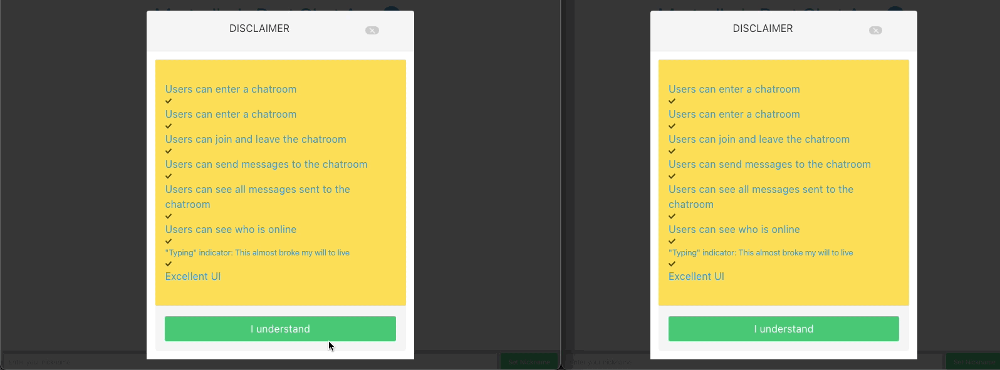

# Murtadha's Chat App (MCA) 
# A simple chat app using Node.js, Express, Socket.io
---

#### DEMO

</img>
### Features
- [x] User can join a room
- [x] User can send a message
- [x] User can see who is online
- [x] User can see who is typing
- [x] User can disconnect from a room
- [x] User can see the time of the message
- [x] User can see the date of the message
- [x] User can see the number of users in the room
## Installation

```bash
$npm install 
```

## Usage

```bash
$npm run start
```

## License
[MIT](https://choosealicense.com/licenses/mit/)

## Author
Murtadha Marzouq
